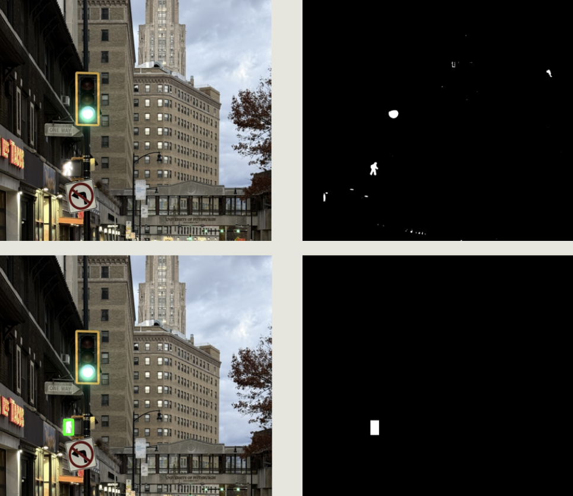
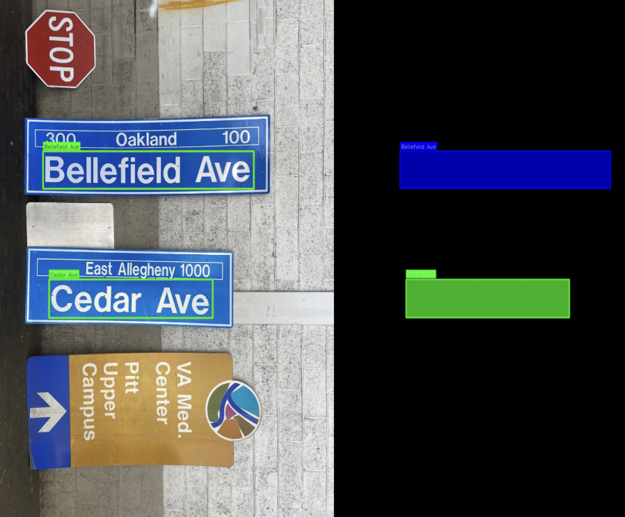
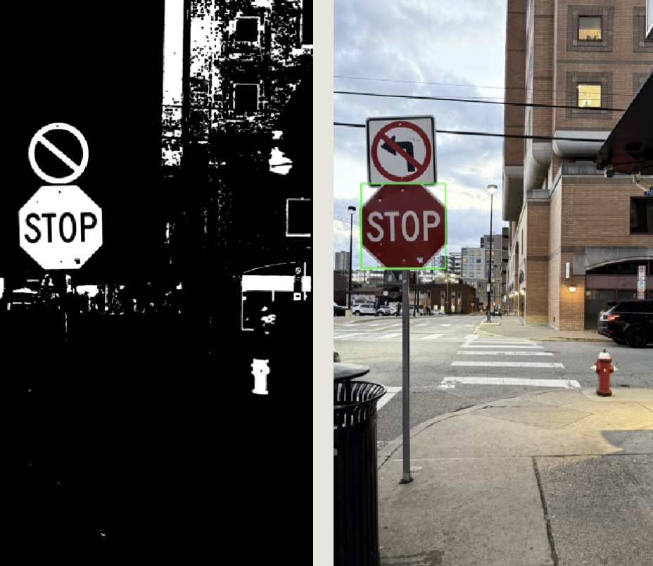
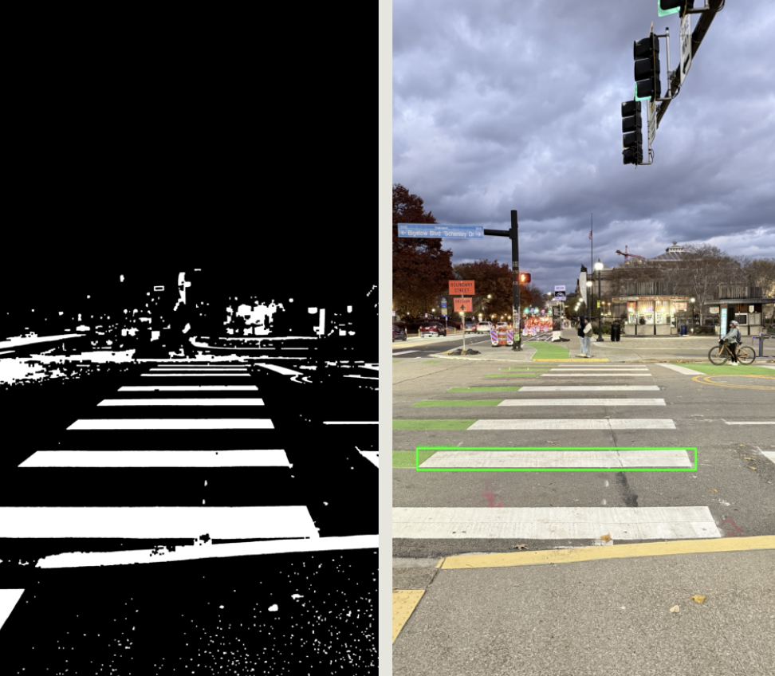
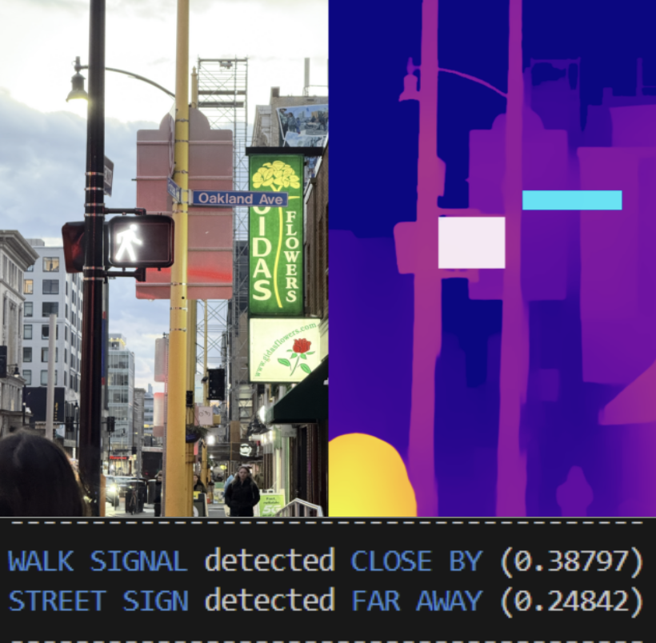
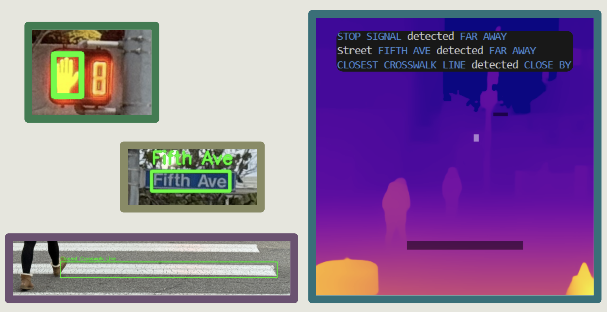
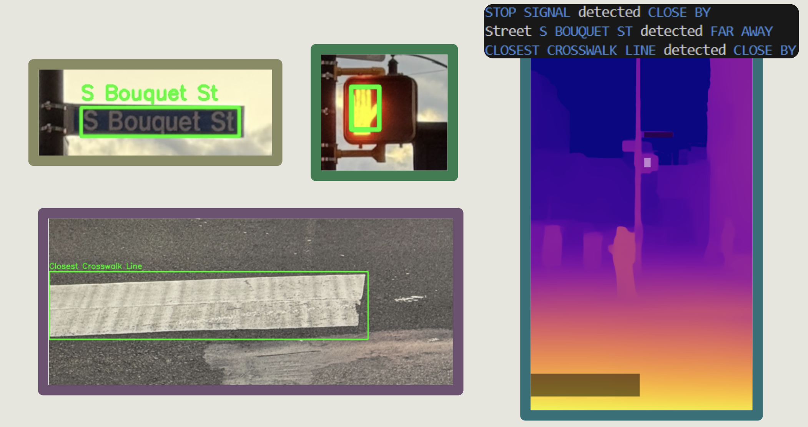
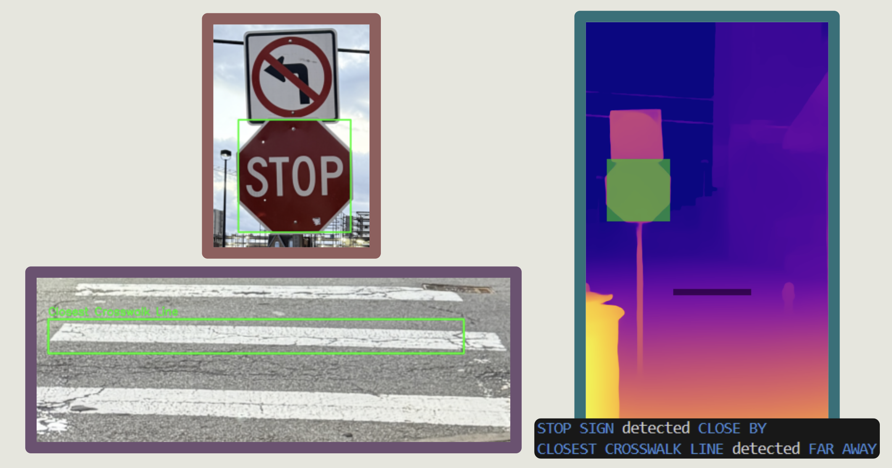

# Pedestrian Vision  

## Team Members  
- PJ Granieri: pjg44@pitt.edu (Street Sign Detection)
- Ricky Zhao: riz12@pitt.edu (Stop Sign and Traffic Light Detection)
- Zachary McPherson: zpm12@pitt.edu (Depth Perception)
- Anthony Spadafore: ams871@pitt.edu (Walk Sign Detection)
- Manelin John Rajan: maj214@pitt.edu (Crosswalk Detection)

---

## Overview
The purpose of this program is to aid visually impaired individuals as they traverse through spaces in their daily lives. In a general sense, what our program will do is utilize an image of an individual’s forward visual field and essentially narrate the physical scenario to the individual, providing crucial information for safe and accurate transportation.  

---

## Walk Sign Detection

Detects the presence of a walk or stop signal.

1. Read image (HSV) and predefined templates (Binary).
2. Perform “red” thresholding, isolating “stop.”
3. Perform “white” thresholding, isolating “walk.”
4. Execute multi-scale template matching.
5. If the largest found correlation coefficient (r) is greater than the set threshold, the object was successfully detected.
6. Return a mask of the location of found signal.

---

## Street Sign Detection

Detects the presence of street signs and their contents.

1. Read image (HSV).
2. Detect blue regions using adaptive thresholding.
3. Apply morphological operations to clean mask.
4. Extract contours and filter candidates by size and aspect ratio.
5. Perform OCR on each blue region using EasyOCR.
     - Apply CLAHE enhancement if needed.
6. Clean and validate text using street suffix dict.
7. Merge nearby fragments into street names.
     - Combine complementary pairs (name + suffix).
8. Return a mask of the location(s) of the found signs

---

## Stop Sign Detection

Detects the presence of stop signs.

1. Read image (HSV).
2. Detect all red to create a binary mask.
3. Search for contours that match an octagon via various filters.
4. Define a region of interest (ROI) for each octagon that is found.
5. Uses EasyOCR to search for the text “STOP” within each ROI.
6. Returns a mask of the bounding box to be passed into the depth perception module.

---

## Crosswalk Detection

Detects the presence of a crosswalk.

1. Read image (Grayscale).
2. Perform thresholding to isolate all bright white road markings.
3. Find all rectangles through contour analysis.
4. Filter rectangles by their horizontal aspect ratio and length.
5. Locate the rectangle with the largest area.
6. Return a mask highlighting the location of found rectangle.

## Depth Perception

Computes the depth estimation across the image using MiDaS.

1. Read Image (RGB) and masks from the other modules.
2. Find depth estimation across the image.
3. Calculate the average depth estimation within each mask.

    - Returns a value between [0, 1].
    - Not a representation of the real-world distance.
4. Using a set threshold value, the average depth estimation is determined to be CLOSE BY or FAR AWAY.

---
## Sample Outputs

---

## Challenges and Future Works

While our program was an overall success, we still ran into some issues…

Issue: Color thresholding methods varied in performance based on the time of day.

Mitigation: Adaptive thresholding using EXIF metadata and predefined color thresholds (needs a larger dataset).

Issue: MiDaS does not compute real-world depth information, just a relative estimation of how far away objects in the frame are from the camera.

Mitigation: Use a video feed with structure-from-motion techniques or a stereo camera setup to get real-world depth information.

Issue: Test cases with too much noise affected the accuracy of the detection. Some results are not entirely ideal.

Mitigation: Fine tune thresholding and filtering; use other detected objects to crop initial image.

Issue: Template matching algorithm took a relatively long time to execute, effectively limiting framerate.

Mitigation: Develop more efficient filtering methods, reducing reliability on template matching.

